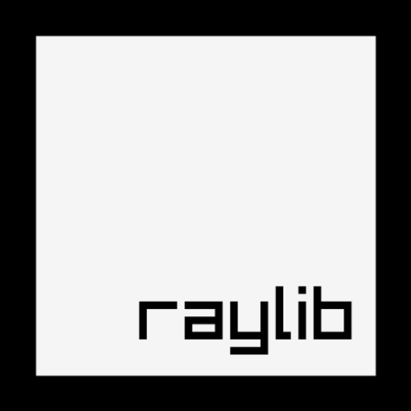

# Raymob [](https://raylib.com) [](https://developer.android.com/) [](LICENSE) [](LICENSE)

Raymob is a simple implementation of [raylib](https://www.raylib.com/) for Android.

## Prerequisites

**You will need SDK API 33.0.0 and NDK r21 (or higher, compatible with CMake 3.22.1).**

If you already have this version of SDK and NDK without having Android Studio, you should still be able to compile the project using `gradlew.bat` for Windows or `gradlew` for Linux or MacOS.

## How to Use?

1. Open the `gradle.properties` file and fill in the necessary values for your application, such as the app name, package name, version, etc.
2. That's it! You can start coding your raylib app in the `app/src/main/cpp` directory!

**Note**: Do not modify the instances of `com.raylib.raymob` and `raymob` as they will be automatically replaced during compilation with the information provided in `gradle.properties`.

## Compatibility

By default, the Raymob template targets APIs 24 to 33, which corresponds from Android 7.0 to Android 13 (_so 96.2% of devices according to [apilevels.com](https://apilevels.com/)_). You can also adapt it to target other API versions if necessary.

This project is fully C/C++ compatible for the logical part with raylib and you can also customize the Java part to your wishes.

## Customization

This template can be customized to meet your specific needs. You can add dependencies to the project via Gradle or additional native libraries by adding them to the `app/libs` directory and making the necessary modifications in the `CMakeLists.txt` file.

## Additional Information

In this project, you will find a slightly modified version of raylib 4.5 that includes some bug fixes from raylib 4.6-dev and the addition of the `GetAndroidApp()` function from `rcore.c` into the API.

This function allows you to obtain the `struct android_app`, which you can find the official documentation for [here](https://developer.android.com/reference/games/game-activity/structandroid/app).

```c
RLAPI struct android_app *GetAndroidApp(void);
```

Furthermore, there is also the addition of a header file `raymob.h` that can be used as a replacement for `raylib.h` and adds new functionalities that can be enabled through `gradle.properties`.
These include the **software keyboard**, **vibration**, and **accelerometer** of the device. You can check the header file [raymob.h](app/src/main/cpp/deps/raymob/raymob.h) if you need additional Android-related features that raylib does not support.
These new functions also simplify the process of invoking both static and non-static public methods of your NativeLoader class from your C/C++ code.

## Useful Links

- [AdMob Integration in Raymob](https://gist.github.com/Bigfoot71/b3a658458ece93ddcb06f4c78f85076a): Gist demonstrating the integration of AdMob in Raymob.

## Contributions

If you believe that your repositories or gists related to Raymob can be beneficial to others, please feel free to reach out to me or open a pull request to have them added here.
I welcome contributions and collaborations to enhance the Raymob project and make it more valuable for the community.

You can also contribute to the project by reporting issues, suggesting improvements, or helping to document the project. Your input is highly appreciated!

### Support

If you have any questions or encounter problems when using this implementation, please do not hesitate to ask for help by submitting an issue on this repository, this may help other users.
